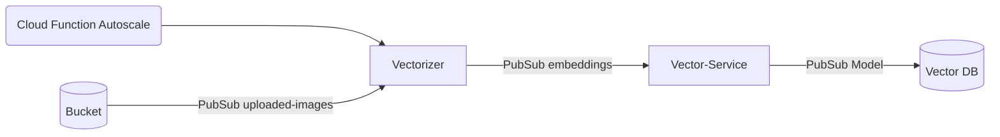

I would like to build a microservice that just reads from a pubsub queue and autoscales up and down depending on if there are messages in the pubsub queue

Bucket `images-bucket`
- triggered to send images into the pubsub queue on file upload

CloudFunction `autoscaler-cloud-function`
- checks how many messages are in the pubsub queue every 10 mins and if there are zero messages auto scale vectorizer off if there are messages make sure vectorizer is on

VM `vectorizer`
- large VM that has a gpu to run large deep learning models. Turns image into an embedding and sends result down a pubsub queue

CloudRun `vector-service`
- maps and saves embedding to db

I created a pubsub queue called uploaded-images-test'
`gcloud pubsub topics publish uploaded-images-test --message "Hello"`
"messageIds:
- '8930900425322741'"
